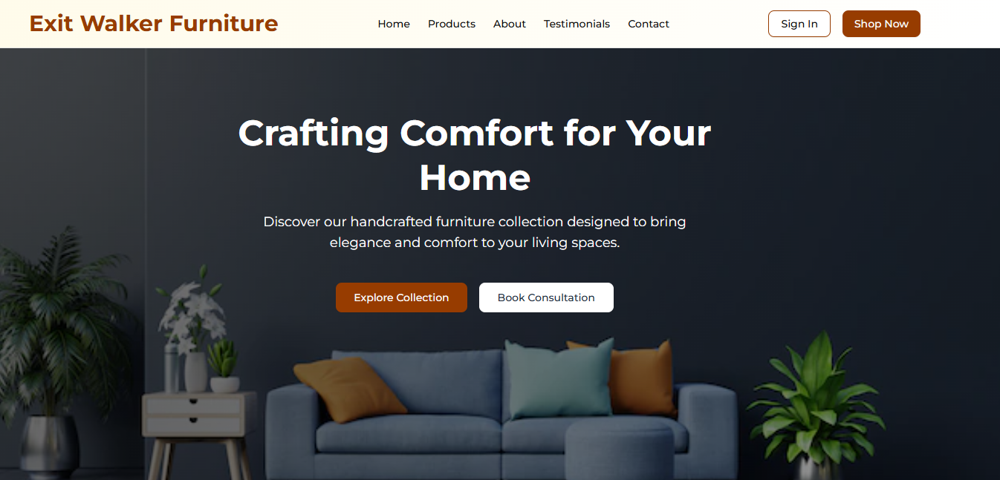

# Exit Walker Furniture

A modern, responsive e-commerce website for a premium furniture store built with Next.js, TypeScript, and Tailwind CSS. Features elegant animations, comprehensive product pages, and a warm, cozy design aesthetic.

## 🌟 Features

### Core Functionality
- **Responsive Design**: Fully responsive across all devices and screen sizes
- **Modern UI/UX**: Clean, elegant design with warm amber color scheme and subtle gradients
- **Smooth Animations**: AOS (Animate On Scroll) animations throughout the site
- **Product Catalog**: Comprehensive product listings with filtering and sorting
- **Product Details**: Detailed product pages with image galleries, specifications, and reviews
- **Customer Reviews**: Interactive review system with ratings and testimonials
- **Contact Forms**: Multiple contact forms for customer inquiries

### Technical Features
- **Next.js 14**: Built with the latest Next.js App Router
- **TypeScript**: Full type safety throughout the application
- **Tailwind CSS**: Utility-first CSS framework for rapid development
- **shadcn/ui**: High-quality, accessible UI components
- **Static Export**: Optimized for deployment to GitHub Pages
- **SEO Optimized**: Proper meta tags and semantic HTML structure

### Pages & Components
- **Homepage**: Hero section, featured products, testimonials, and company overview
- **Products Page**: Complete product catalog with search, filtering, and sorting
- **Product Detail Pages**: Individual product pages with galleries, specs, and reviews
- **About Page**: Company history, values, team, and crafting process
- **Testimonials Page**: Customer reviews organized by product category
- **Contact Page**: Contact information, forms, and showroom details

## 🎨 Design System

### Color Palette
- **Primary**: Amber (amber-800: #92400e)
- **Secondary**: Warm grays and whites
- **Accents**: Subtle amber gradients
- **Background**: Gradient from amber-50/50 to white

### Typography
- **Font**: Inter (Google Fonts)
- **Headings**: Bold weights (600-700)
- **Body**: Regular weight (400)
- **Accent**: Medium weight (500)

### Components
All UI components are built using shadcn/ui for consistency and accessibility:
- Buttons with hover states and variants
- Cards with gradient backgrounds
- Form inputs with focus states
- Navigation with mobile responsiveness
- Tables for structured data display

## 📱 Responsive Design

The website is fully responsive with breakpoints:
- **Mobile**: < 768px
- **Tablet**: 768px - 1024px
- **Desktop**: > 1024px

Key responsive features:
- Mobile-first navigation with hamburger menu
- Responsive grid layouts
- Optimized image sizes
- Touch-friendly interactive elements

## 🎭 Animations

The site uses AOS (Animate On Scroll) for smooth animations:

### Animation Types
- **fade-up**: Elements slide up while fading in
- **fade-down**: Elements slide down while fading in
- **fade-left/right**: Elements slide horizontally while fading in
- **zoom-in**: Elements scale up while fading in

## 🛠 Development

### Code Style
- **TypeScript**: Strict type checking enabled
- **ESLint**: Code linting for consistency
- **Prettier**: Code formatting (recommended)
- **Component Structure**: Functional components with TypeScript interfaces

### Component Guidelines
1. **Reusability**: Components are designed to be reusable across pages
2. **Props Interface**: All components have TypeScript interfaces for props
3. **Accessibility**: Components follow WCAG guidelines
4. **Performance**: Optimized with React best practices

### Adding New Components
1. Create component in \`components/\` directory
2. Define TypeScript interface for props
3. Export component for use in other files
4. Add to appropriate page or layout

### Adding New Pages
1. Create page file in \`app/\` directory
2. Follow Next.js App Router conventions
3. Include proper metadata for SEO
4. Implement responsive design

## 🔍 SEO Features

- **Meta Tags**: Proper title and description tags
- **Semantic HTML**: Proper heading hierarchy and semantic elements
- **Image Alt Text**: All images include descriptive alt text
- **Structured Data**: Product and business information markup
- **Sitemap**: Generated automatically by Next.js
- **Performance**: Optimized images and code splitting

## 🧪 Testing

### Manual Testing Checklist
- [ ] All pages load correctly
- [ ] Navigation works on all devices
- [ ] Forms submit properly
- [ ] Images display correctly
- [ ] Animations work smoothly
- [ ] Responsive design functions properly

### Browser Compatibility
- Chrome (latest)
- Firefox (latest)
- Safari (latest)
- Edge (latest)
- Mobile browsers (iOS Safari, Chrome Mobile)

## 🤝 Contributing

1. **Fork the repository**
2. **Create a feature branch**
   \`\`\`bash
   git checkout -b feature/amazing-feature
   \`\`\`
3. **Commit your changes**
   \`\`\`bash
   git commit -m 'Add some amazing feature'
   \`\`\`
4. **Push to the branch**
   \`\`\`bash
   git push origin feature/amazing-feature
   \`\`\`
5. **Open a Pull Request**

### Development Guidelines
- Follow existing code style and patterns
- Add TypeScript types for new components
- Test on multiple devices and browsers
- Update documentation for new features
- Ensure accessibility compliance

## 📄 License

This project is licensed under the MIT License - see the [LICENSE](LICENSE) file for details.

## 🙏 Acknowledgments

- **Next.js Team**: For the amazing React framework
- **Tailwind CSS**: For the utility-first CSS framework
- **shadcn/ui**: For the beautiful, accessible UI components
- **AOS Library**: For smooth scroll animations
- **Lucide React**: For the icon library
- **Vercel**: For hosting and deployment platform

## 📞 Support

For support, email troylegacy256@gmail.com or create an issue in this repository.

## 🔗 Links

- **Live Demo**: [https://exitwalkerfurniture.vercel.app](https://exitwalkerfurniture.vercel.app)
- **Repository**: [https://github.com/github.com/TroyMoses/walker-furniture](https://github.com/github.com/TroyMoses/walker-furniture)
- **Issues**: [https://github.com/github.com/TroyMoses/walker-furniture/issues](https://github.com/github.com/TroyMoses/walker-furniture/issues)

---

**Exit Walker Furniture** - Crafting Comfort for Your Home 🏠✨
\`\`\`

